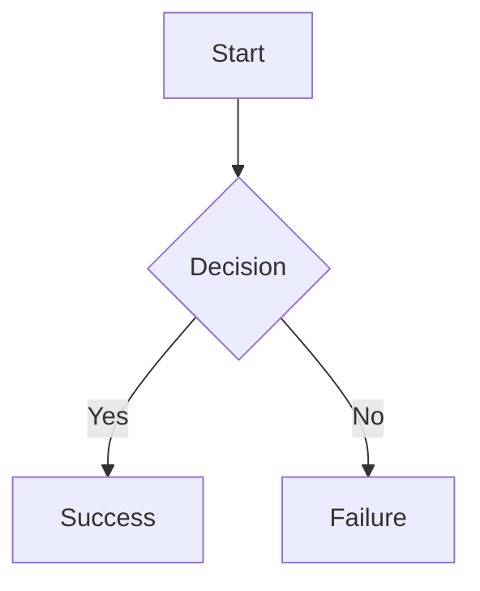
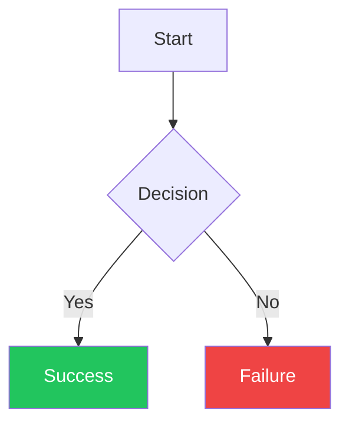
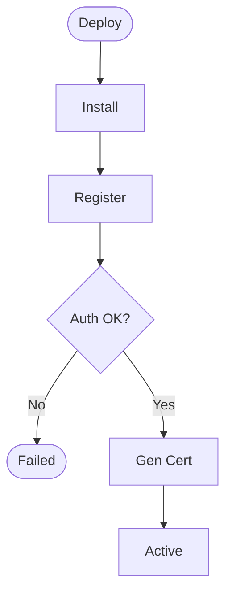

# Beautiful Mermaid Skill

## Overview
This skill uses the **actual beautiful-mermaid library** (https://github.com/lukilabs/beautiful-mermaid) to render Mermaid diagrams with native CSS custom properties support, live theme switching, and both SVG and ASCII output options.

**Key Advantages over standard Mermaid.js:**
- ✨ Real CSS custom properties (`--bg`, `--fg`, `--line`, `--accent`, `--muted`)
- ✨ Live theme switching without re-rendering
- ✨ Exact output from https://agents.craft.do/mermaid
- ✨ ASCII/Unicode output for terminal contexts
- ✨ 15 built-in professionally curated themes
- ⚡ Ultra-fast server-side rendering
- 🖼️ Maximize view (no browser permissions needed)
- 🎯 Viewing pane fills available viewport space

## Skill Package Structure

This skill is packaged as a .zip containing:

```
beautiful-mermaid.zip
├── SKILL.md                        # This file - main documentation
├── setup.sh                        # Auto-setup script for dependencies
├── create-diagram.sh               # Optimized single-command diagram creator (RECOMMENDED)
├── template.html                   # Complete HTML template (USE THIS)
└── beautiful-mermaid-render.mjs    # Renderer script
```

## Quick Start for Claude

**RECOMMENDED: Use the optimized script for best performance (see below)**

### Option 1: Optimized Workflow (RECOMMENDED - 2 tool calls)

This is the **fastest** method - creates complete diagrams in a single script:

```bash
bash /mnt/skills/user/beautiful-mermaid/create-diagram.sh \
    "flowchart TD
        Start([User Login]) --> Auth[Authenticate]
        Auth --> Access([Access Granted])" \
    "Login Process" \
    "login-process" \
    "github-light"
```

**Arguments:**
1. `diagram_code` - Mermaid diagram syntax
2. `title` - Diagram title (for <title> and <h1>)
3. `output_name` - Output filename (without .html extension)
4. `theme` - Theme name (optional, defaults to "github-light")

**Performance:** Only 2 tool calls total:
1. One bash script call (handles setup, render, theme, replace, output)
2. present_files call

This is **3-4x faster** than the step-by-step approach.

### Option 2: Step-by-Step Workflow (Educational - 7+ tool calls)

**CRITICAL - Follow these steps for EVERY diagram:**

### Step 1: Run Setup (First Time Per Session)
```bash
# Check if setup is needed and run it
if [ ! -f /home/claude/beautiful-mermaid-render.mjs ] || [ ! -d /home/claude/node_modules/beautiful-mermaid ]; then
    bash /mnt/skills/user/beautiful-mermaid/setup.sh
fi
```

### Step 2: Render the SVG
```bash
node /home/claude/beautiful-mermaid-render.mjs "flowchart TD
    Start[Start] --> End[End]" "github-light" "svg" > /home/claude/diagram.svg
```

### Step 3: Read and Use the Template
```bash
# Copy the template to working directory
cp /mnt/skills/user/beautiful-mermaid/template.html /home/claude/diagram.html

# Read the generated SVG
cat /home/claude/diagram.svg
```

### Step 4: Embed SVG in Template
- Open `/home/claude/diagram.html`
- Replace the placeholder `<!-- INSERT_SVG_HERE -->` with the actual SVG content
- Update the `<title>` and `<h1>` with diagram-specific titles
- Ensure SVG has proper CSS custom properties for theme switching

### Step 5: Save to Outputs
```bash
cp /home/claude/diagram.html /mnt/user-data/outputs/your-diagram-name.html
```

## Template Usage

The `template.html` file contains a **complete, production-ready** HTML page with:

✅ All required CSS for maximize, zoom, pan, drag
✅ Theme switching (2 themes: GitHub Light, GitHub Dark) — full-page: body, controls, and container all adapt
✅ Zoom slider (10%-300%)
✅ Maximize button (works without browser permissions)
✅ Mouse wheel zoom (Ctrl+scroll)
✅ Pan and drag support
✅ Reset button
✅ Responsive design
✅ All JavaScript functionality

**DO NOT recreate the template from scratch.** Always use the provided `template.html` as your base.

### Customization Points

When using the template, you only need to modify:

1. **Title and Heading** (lines 5 and 273):
   ```html
   <title>Your Diagram Title Here</title>
   ...
   <h1>Your Diagram Title Here</h1>
   ```

2. **SVG Content** (around line 308):
   Replace `<!-- INSERT_SVG_HERE -->` with your rendered SVG

3. **SVG CSS Properties** (ensure these are set in the SVG):
   ```html
   <svg ... style="--bg:#ffffff;--fg:#1f2328;--line:#6e7781;--accent:#6e7781;background:var(--bg)">
   ```

4. **SVG Internal Styles** (add these inside `<style>` tag in SVG):
   ```css
   svg {
     --_inner-stroke: #8c959f;  /* Visible borders for small labels */
   }
   text[font-weight="400"] {
     font-weight: 600;  /* Bold text for readability */
   }
   ```

## Core Requirements

### CRITICAL: Always Use Latest Features
**Every diagram artifact MUST include ALL current best practices and features:**
- ✅ Use the provided `template.html` as base
- ✅ Zoom slider controls (10%-300%)
- ✅ Light/Dark theme switching (minimum 2 themes: github-light, github-dark)
- ✅ Maximize button for full viewport viewing
- ✅ Viewing pane fills available viewport (flexbox stretch)
- ✅ Pan and drag support
- ✅ Mouse wheel zoom (Ctrl+scroll)
- ✅ Proper contrast for small labels (bold text, visible borders)
- ✅ Gray lines and arrows (not blue)
- ✅ Responsive design
- ✅ Clean, professional styling

## Built-in Themes

All 15 beautiful-mermaid themes are available:

**Minimal/Clean:**
- `tokyo-night` - Recommended default (dark blue, well-balanced)
- `github-light` - Clean GitHub aesthetic
- `github-dark` - GitHub dark mode

**Light Themes:**
- `tokyo-night-light` - Soft blue accents
- `catppuccin-latte` - Warm purple tones
- `nord-light` - Cool Nordic palette
- `solarized-light` - Classic Solarized
- `zinc-light` - Neutral grays

**Dark Themes:**
- `tokyo-night-storm` - Deeper blue variant
- `catppuccin-mocha` - Rich purple darkness
- `nord` - Nordic dark
- `dracula` - Vibrant purple theme
- `solarized-dark` - Classic dark Solarized
- `one-dark` - Atom's One Dark
- `zinc-dark` - Neutral dark grays

## CSS Custom Properties

Beautiful-mermaid uses a 2-color foundation with automatic derivations:

**Core Properties:**
```css
--bg: #1a1b26      /* Background color */
--fg: #a9b1d6      /* Foreground color */
```

**Optional Enrichments:**
```css
--line: #3d59a1    /* Edge/connector color */
--accent: #6e7781  /* Arrow heads, highlights (gray, not blue) */
--muted: #565f89   /* Secondary text, labels */
```

**Automatically Derived:**
```css
--_text:          var(--fg)
--_text-sec:      color-mix(in srgb, var(--fg) 60%, var(--bg))
--_text-muted:    color-mix(in srgb, var(--fg) 40%, var(--bg))
--_line:          color-mix(in srgb, var(--fg) 30%, var(--bg))
--_arrow:         color-mix(in srgb, var(--fg) 50%, var(--bg))
--_node-fill:     color-mix(in srgb, var(--fg) 3%, var(--bg))
--_node-stroke:   color-mix(in srgb, var(--fg) 20%, var(--bg))
```

## Best Practices

### Diagram Design
- Keep node text concise (1-5 words max per line)
- Use clear decision labels ("Yes"/"No", "Success"/"Fail")
- Prefer top-down (TD) or left-right (LR) flow
- Group related nodes with subgraphs
- **NEVER use HTML tags in node labels** - they render as literal escaped text
- Use single-line labels only - multi-line text creates rendering issues

### Avoiding Line Clutter (CRITICAL)

**Line clutter** is the #1 diagram quality issue. Follow these rules:

1. **Shorten ALL node labels**:
   - BAD: Long multi-word labels or labels with HTML tags
   - GOOD: `Auth OK?` or `Store Certificate`
   - Target: Under 20 characters per label

2. **Eliminate redundant nodes**:
   - BAD: `Register → Auth → Fail → Retry? → Yes → Register` (creates loop)
   - GOOD: `Register → Auth → Fail/Success` (clean split)

3. **Consolidate decision points**:
   - If multiple decisions lead to same outcome, combine them
   - Avoid cascading decisions that could be one check

4. **Minimize feedback loops**:
   - Keep loops short (3-4 nodes maximum)
   - Don't create loops that span entire diagram
   - Avoid multiple paths returning to same node

5. **Remove intermediate "status" nodes**:
   - BAD: `Auth Failed → Registration Failed → Retry?`
   - GOOD: `Auth Failed → Retry?`

**Before creating a complex diagram, ask: "Can I split this into 2-3 simpler diagrams?"**

### Theme Selection
- **github-light** - Default theme for all diagrams
- **github-dark** - Full-page dark mode (body, controls, and container all adapt)

### Styling Consistency (CRITICAL — NO CUSTOM COLORS)

**ALL node colors are controlled by the beautiful-mermaid theme system via CSS custom properties. NEVER override them.**

**BANNED Mermaid syntax — do NOT use any of these:**
- `style NodeName fill:#color,stroke:#color` — banned
- `classDef className fill:#color` — banned
- `class NodeA,NodeB className` — banned
- `:::className` — banned
- Any inline `fill:`, `stroke:`, `color:`, or `background:` on nodes — banned

**Why:** Custom colors (green, red, blue, orange, etc.) break theme switching, look inconsistent, and create visual noise. The theme system automatically derives all node fills, strokes, and text colors from `--bg` and `--fg`. This gives a uniform, professional look that adapts to both Light and Dark themes.

**If the user asks for colored nodes:** Only then may you use `classDef`/`style`, and explain that custom colors will not adapt to theme switching.

**Correct approach — let the theme handle everything:**


**Wrong approach — never do this unless explicitly asked:**


### Color Contrast Requirements
- Small label boxes (Yes/No, Valid/Invalid) need darker borders for visibility
- **Always set** `--_inner-stroke: #8c959f` in SVG styles for visible borders
- Make small text bold (font-weight: 600) for readability
- Test contrast in both light and dark themes
- Ensure arrow colors match line colors for consistency
- Lines should be gray, not blue, for professional look

## Common Anti-Patterns to AVOID

### ❌ ANTI-PATTERN 1: Custom Colors on Nodes
**NEVER use `style`, `classDef`, `class`, or `:::` to set custom colors on nodes.** The theme system controls all colors. Custom fills (green, red, blue, orange) break theme switching and look inconsistent.

```mermaid
# ❌ WRONG - Custom colors
flowchart TD
    A[OK] --> B[Error]
    style A fill:#22c55e,color:#fff
    style B fill:#ef4444,color:#fff

# ✅ CORRECT - Let the theme handle it
flowchart TD
    A[OK] --> B[Error]
```

### ❌ ANTI-PATTERN 2: Using HTML Tags in Labels
**NEVER use HTML tags (like line break tags) in node labels** - they render as literal escaped text.
Always use short, single-line labels instead.

```mermaid
# ✅ CORRECT - Short single-line labels only
flowchart TD
    Auth{Auth OK?}
    Store[Store Certificate]
```

### ❌ ANTI-PATTERN 3: Redundant Status Nodes
Creates unnecessary boxes and extra lines.

```mermaid
# ❌ WRONG - Redundant "Failed" node
Register → Auth{OK?}
Auth -->|No| Failed[Registration Failed]
Failed → Retry{Retry?}

# ✅ CORRECT - Direct to decision
Register → Auth{OK?}
Auth -->|No| Retry{Retry?}
```

### ❌ ANTI-PATTERN 4: Overlapping Loops
Multiple paths to same node create visual spaghetti.

```mermaid
# ❌ WRONG - Two paths to Register
Install → Register
Retry{Retry?} -->|Yes| Register

# ✅ CORRECT - Loop back to Install
Install → Register
Retry{Retry?} -->|Yes| Install
```

### ❌ ANTI-PATTERN 5: Long Labels
Creates wide nodes and forces lines to cross.

```mermaid
# ❌ WRONG
[Store Certificate in Local Machine Store]
{Authentication was Successful?}

# ✅ CORRECT
[Store Certificate]
{Auth OK?}
```

### ✅ CORRECT PATTERN: Clean Flow
- Short labels (< 20 chars)
- No HTML tags in labels
- Minimal loops
- Direct paths
- No redundant nodes



## Workflow Examples

### Recommended: Optimized Single-Script Approach

The fastest way to create a diagram (2 tool calls total):

```bash
# One command creates the complete diagram
bash /mnt/skills/user/beautiful-mermaid/create-diagram.sh \
    "flowchart TB
        User[User] --> App[Application]
        App --> DB[(Database)]
        DB --> App
        App --> User" \
    "System Architecture" \
    "system-architecture" \
    "github-light"

# Then present to user
# present_files: /mnt/user-data/outputs/system-architecture.html
```

**Performance:** 3-4x faster than step-by-step approach.

### Alternative: Step-by-Step Approach

For learning or debugging (7+ tool calls):

```bash
# 1. Setup (if needed)
if [ ! -f /home/claude/beautiful-mermaid-render.mjs ]; then
    bash /mnt/skills/user/beautiful-mermaid/setup.sh
fi

# 2. Create Mermaid diagram code
DIAGRAM_CODE="flowchart TB
    User[User] --> App[Application]
    App --> DB[(Database)]
    DB --> App
    App --> User"

# 3. Render SVG
node /home/claude/beautiful-mermaid-render.mjs "$DIAGRAM_CODE" "github-light" "svg" > /home/claude/diagram.svg

# 4. Copy template
cp /mnt/skills/user/beautiful-mermaid/template.html /home/claude/my-diagram.html

# 5. Read SVG content
SVG_CONTENT=$(cat /home/claude/diagram.svg)

# 6. Use str_replace to embed SVG in template
# Replace <!-- INSERT_SVG_HERE --> with actual SVG
# Update titles as needed

# 7. Save to outputs
cp /home/claude/my-diagram.html /mnt/user-data/outputs/my-diagram.html
```

## Quality Checklist

Before presenting diagram, verify ALL requirements are met:
- [ ] **CRITICAL**: Setup script ran automatically on first use
- [ ] **CRITICAL**: Used `template.html` as base (not recreated from scratch)
- [ ] **CRITICAL**: Artifact uses ALL latest features from this skill
- [ ] **CRITICAL**: NO HTML tags in node labels (they render as literal escaped text)
- [ ] **CRITICAL**: All node labels are under 20 characters
- [ ] **CRITICAL**: No redundant intermediate status nodes
- [ ] **CRITICAL**: Feedback loops are short and minimal
- [ ] Rendered using beautiful-mermaid library (not Mermaid.js)
- [ ] SVG embedded in HTML artifact
- [ ] Theme switching controls included (Light/Dark minimum)
- [ ] **Zoom slider included** (range slider 10%-300%)
- [ ] **Maximize button included** for full viewport viewing
- [ ] **Container fills available viewport** (flexbox stretch below controls)
- [ ] Mouse wheel zoom working (Ctrl+scroll)
- [ ] Pan and drag functionality enabled
- [ ] CSS custom properties working (`--bg`, `--fg`, etc.)
- [ ] Diagram syntax correct (flowchart, not graph)
- [ ] Text is concise and readable
- [ ] Small labels (Yes/No) have **visible borders** (`--_inner-stroke: #8c959f`)
- [ ] Small labels have **bold text** (font-weight: 600)
- [ ] Lines and arrows are **gray**, not blue
- [ ] Arrow colors match line colors for consistency
- [ ] **CRITICAL**: No `style`, `classDef`, `class`, or `:::` in Mermaid code — theme controls all colors
- [ ] Theme matches context/user preference
- [ ] File saved to `/mnt/user-data/outputs/`
- [ ] HTML renders correctly in browser
- [ ] **Visual check**: No overlapping or crossing lines
- [ ] **Visual check**: Diagram is easy to follow left-to-right or top-to-bottom

**If any checkbox is unchecked, the artifact is incomplete and must be updated.**

## Troubleshooting

**Setup fails:**
- Check network access
- Verify npm is available
- Try running setup commands manually
- Check `/home/claude/node_modules/beautiful-mermaid` exists

**SVG not rendering:**
- Check that SVG is properly embedded in HTML
- Verify no syntax errors in Mermaid code
- Ensure SVG has proper CSS custom properties

**Text shows escaped HTML tags literally:**
- **NEVER use HTML tags** in node labels
- Use single-line labels only
- Keep labels under 20 characters

**Diagram has overlapping/crossing lines:**
- Shorten all node labels (under 20 chars)
- Remove redundant intermediate nodes
- Simplify feedback loops
- Split complex diagram into multiple simpler ones
- Eliminate retry/loop mechanisms that create redundant paths

**Theme switching not working:**
- Ensure SVG has CSS custom properties in style attribute
- Check JavaScript is included from template
- Verify theme object has correct colors

**Maximize not working:**
- This uses CSS positioning, not browser fullscreen API
- Should work in all contexts without permissions
- Check browser console for JavaScript errors

**Template file not found:**
- Ensure skill is uploaded as .zip with all files
- Check `/mnt/skills/user/beautiful-mermaid/template.html` exists
- Verify file paths in skill configuration

## Changelog

Track improvements to ensure all artifacts stay current:

### Latest Version (Current) - v7
**RECOMMENDED: Use optimized workflow (create-diagram.sh)**

**Features that MUST be in every artifact:**
- ✅ **Optimized single-script workflow** (create-diagram.sh) - 3-4x faster
- ✅ **Performance improvement**: 2 tool calls instead of 7+
- ✅ Skill packaged as .zip with separate files
- ✅ Complete template.html file (always use this)
- ✅ Auto-setup on first use per session
- ✅ **Anti-patterns section** with concrete examples
- ✅ **Never use HTML tags in labels** - they render as literal escaped text
- ✅ **Line clutter avoidance** - short labels, minimal loops
- ✅ **Quality checks for visual clarity** - no overlapping lines
- ✅ Maximize button for full viewport (no permissions needed)
- ✅ Viewing pane fills available viewport
- ✅ Zoom slider (10%-300%)
- ✅ Light/Dark theme switching (GitHub Light, GitHub Dark)
- ✅ Mouse wheel zoom with Ctrl+scroll
- ✅ Pan and drag support
- ✅ Bold text for small labels (font-weight: 600)
- ✅ Visible borders for small boxes (`--_inner-stroke: #8c959f`)
- ✅ Gray lines and arrows (consistent professional look)
- ✅ Responsive design with proper viewport
- ✅ ESC key closes maximize mode

### Iteration History

**v7 - Optimized Workflow (Current)**
- Added create-diagram.sh script for optimized performance
- Single-command diagram creation (3-4x faster)
- Reduced from 7+ tool calls to 2 tool calls
- All file operations in single bash script
- SVG theme modification automated
- Updated documentation with recommended workflow
- Step-by-step approach still available for debugging

**v6 - Anti-Patterns & Quality**
- Added comprehensive anti-patterns section
- Explicit warning: NEVER use HTML tags in labels
- Line clutter avoidance guidelines
- Visual quality checks in checklist
- Concrete examples of good vs bad patterns
- Troubleshooting for common visual issues

**v5 - Template Package**
- Converted to .zip package structure
- Separate template.html file
- Maximize feature (CSS-based, no browser permissions)
- Viewing pane fills available viewport
- ESC key support
- Cleaner file organization

**v4 - Auto-Setup**
- Embedded setup script in SKILL.md
- Auto-detection and installation on first use
- No manual setup required

**v3 - Zoom Slider**
- Replaced zoom buttons with smooth range slider
- Better UX for fine-grained zoom control
- Slider syncs with mouse wheel zoom

**v2 - Contrast Improvements**
- Made small label boxes visible (darker borders)
- Bold text for all small labels (Yes/No, Valid/Invalid)
- Changed arrows from blue to gray for consistency
- Fixed faint borders that were hard to see

**v1 - Zoom Controls**
- Added zoom in/out buttons
- Mouse wheel zoom support
- Pan and drag functionality
- Reset to 100% button

**v0 - Foundation**
- Beautiful-mermaid library integration
- Live theme switching with CSS custom properties
- Multiple theme support
- Basic HTML artifact creation

**Each version is cumulative - new artifacts must include ALL features from all versions.**

---

## Meta Information
- **Skill Type**: Document Creation / Visualization
- **Library**: beautiful-mermaid (npm package)
- **Primary Output**: HTML artifacts with embedded SVG
- **Setup**: Auto-configured on first use per session
- **Template**: Complete HTML file included in package
- **Use Cases**: Presentations, documentation, theme demos, architecture diagrams
- **Quality Standard**: Professional, theme-switchable, design-forward, maximize-enabled
